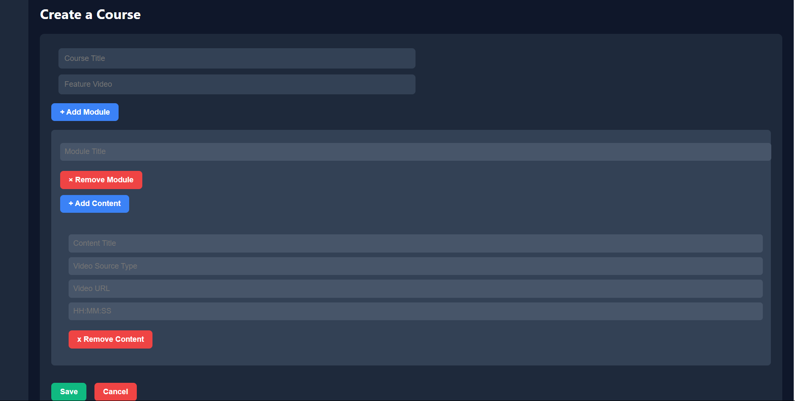

# Course-Creation

# To run this project:
 1. you need laravel 11 or later. 
 2. Php my admin for database. (e.g: Xampp)
 3. Create a database with name coursemanagement.
 4. Run the command composer install
 5. Run the command php artisan migrate
 6. Run the command php artisan serve
 7. Open the browser and type http://localhost:8000
 8. You can see the Course Creatation page.

# To run the front-end:
 1. Open the index.html file in the browser.

# Features:
 1. Course creation.
 2. multiple Modules in the Course.
 3. Multiple Containt in the Modules.

# Screenshots:
 1. Course Creation Page.

 

